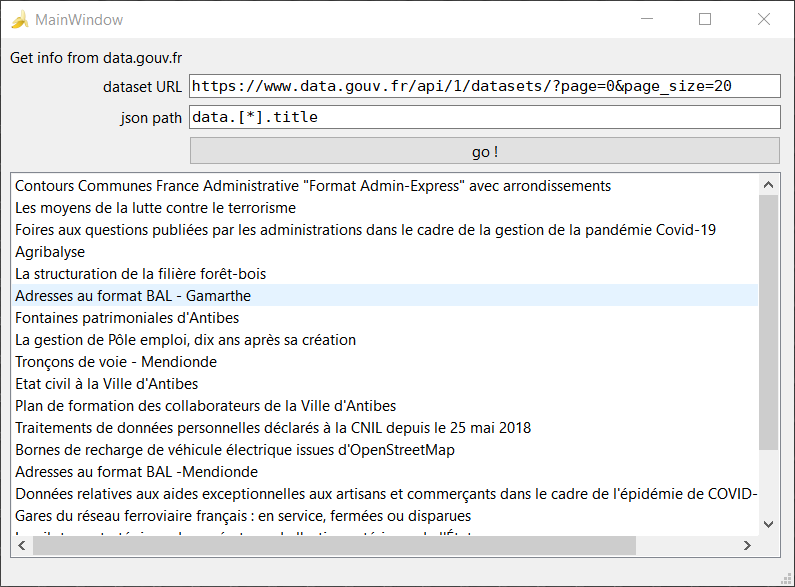
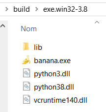
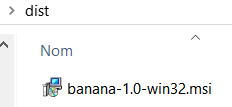

Test du packaging d'une simple application python/Qt sur les 3 environnements.

- windows
- macos
- linux

Essais avec pyinstaler, cxFreeze, nuitka

# Application

L'application "banana" se présente ainsi

(Pourquoi banana ? j'ai trouvé l'icone sympa :) j'ai pas cherché plus loin

Elle interroge l'API de [data.gouv.fr](https://data.gouv.fr) est extrait la liste des données correspondant au path JSON donné.

Ex : Les titres des différentes entrée renvoyées par l'URL de l'API :
 
    json path = data.[*].title
    

# Virtual env
Création d'un environnement virtuel python pour l'application, et installation des packages nécesaires :

    python -m venv <path>
    cd <path>
    pip install -r requirements.txt
   

# cxFreeze

    python setup.py build
    sudo cp app.desktop /usr/share/applications/banana.desktop
    sudo cp -r venv/lib/banana-1.0/ /usr/share/banana
    sudo cp assets/banana.ico /usr/share/pixmaps/banana.ico

# Deploiement sur windows

    ./Scripts\Activate.ps1

Construction du fichier exe

    python setup.py build

Produit 

Construction du fichier msi d'installation
    
    python setup.py bdist_msi

# Déploiement sur linux

Creation d'un tar.gz : build/xxx.tar.gz

sh linux_install.sh
